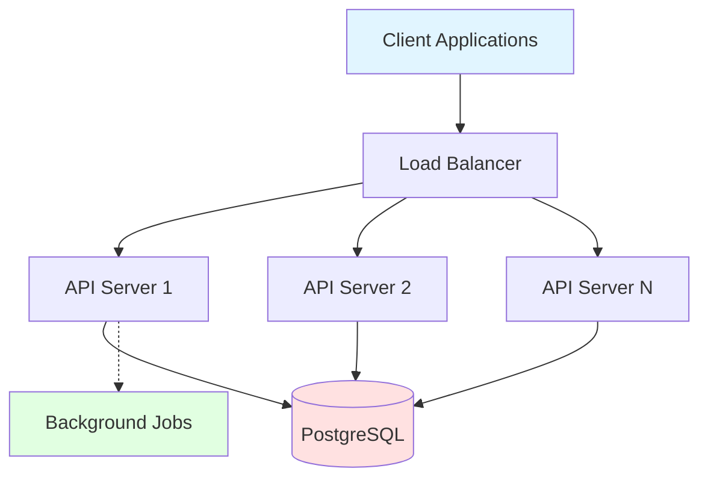
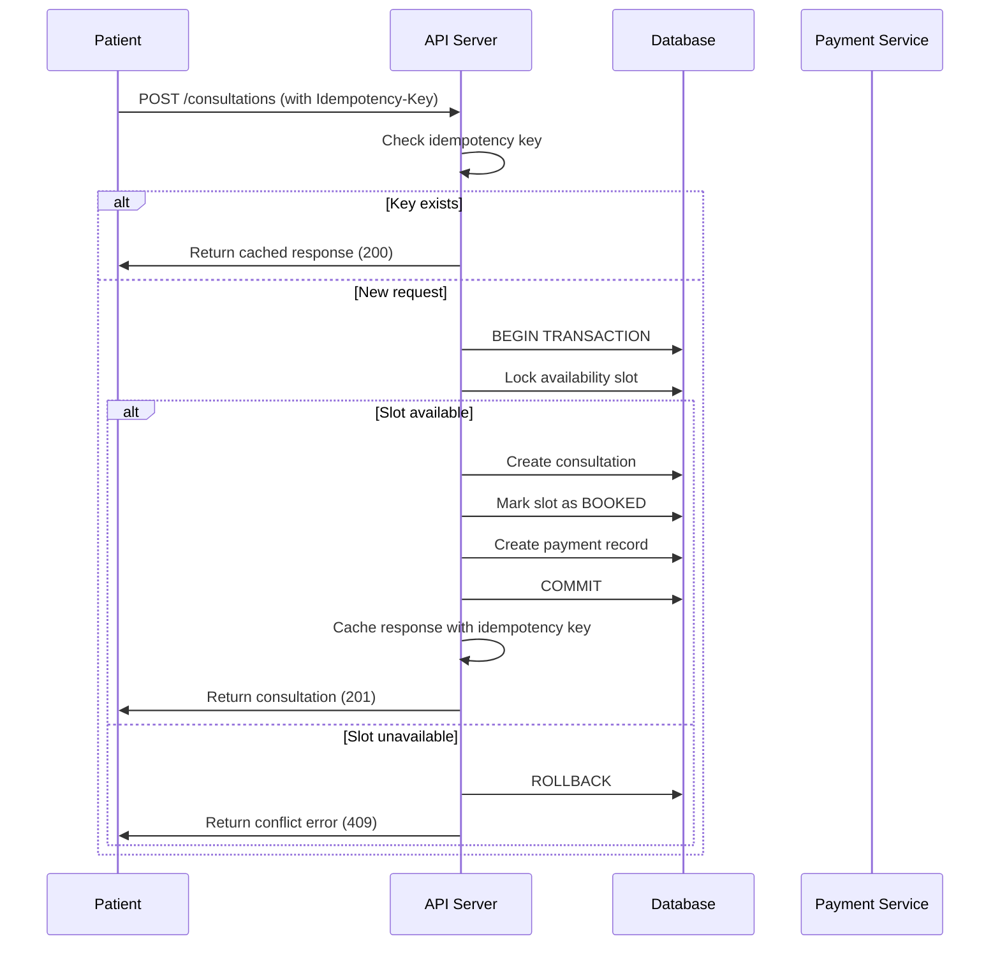

# Amrutam Telemedicine Backend - Architecture Documentation

## Overview

The Amrutam Telemedicine Backend is a production-grade system designed as a **modular monolith** using Node.js, Express, PostgreSQL, and Prisma. The architecture prioritizes scalability, maintainability, and operational excellence while handling ~100k daily consultations.

## High-Level Architecture



## System Components

### 1. API Layer (Express.js)
- RESTful API with versioning (`/api/v1`)
- Middleware stack: CORS, Helmet, Compression, Rate Limiting
- Request logging with correlation IDs
- Metrics collection (Prometheus format)

### 2. Business Logic Layer
- Feature-based modules (auth, users, doctors, consultations, etc.)
- Service classes containing business logic
- Clear separation from data access

### 3. Data Access Layer
- Prisma ORM for type-safe database operations
- Repository pattern where needed
- Transaction management for critical operations

### 4. Database (PostgreSQL)
- Primary data store with ACID guarantees
- Connection pooling for performance
- Indexed queries for fast lookups

### 5. Background Jobs
- In-memory job queue with retry logic
- Consultation reminder system
- Runs every 15 minutes

## Booking Flow Sequence Diagram



## Data Flow

### 1. Request Flow
```
Client Request
  ↓
CORS & Security (Helmet)
  ↓
Request Logging (Pino)
  ↓
Body Parsing
  ↓
Rate Limiting
  ↓
Authentication (JWT)
  ↓
Authorization (RBAC)
  ↓
Idempotency Check
  ↓
Route Handler (Controller)
  ↓
Business Logic (Service)
  ↓
Data Access (Prisma)
  ↓
Database (PostgreSQL)
  ↓
Response
  ↓
Metrics Collection
  ↓
Client Response
```

### 2. Consultation Lifecycle
```
REQUESTED → CONFIRMED → IN_PROGRESS → COMPLETED
     ↓           ↓            ↓
CANCELLED   CANCELLED    CANCELLED
     ↓
  NO_SHOW
```

## Design Decisions

### 1. Monolith vs Microservices
**Decision**: Modular Monolith

**Rationale**:
- Simpler deployment and operations
- Easier to maintain consistency
- Database transactions across modules
- Lower operational overhead
- Can be split into microservices later if needed

### 2. Database Choice
**Decision**: PostgreSQL

**Rationale**:
- ACID compliance for financial transactions
- Excellent performance for relational data
- Rich indexing capabilities
- Row-level locking for concurrency
- Mature ecosystem

### 3. ORM Choice
**Decision**: Prisma

**Rationale**:
- Type-safe database access
- Excellent developer experience
- Auto-generated migrations
- Built-in connection pooling
- Query optimization

### 4. No Redis/External Cache
**Decision**: In-memory solutions

**Rationale**:
- Simplified infrastructure (per project constraints)
- Horizontal scaling still possible
- Stateless application design
- Lower operational complexity

## Concurrency Handling

### Booking Concurrency
- **Database Transactions**: All booking operations wrapped in transactions
- **Row-Level Locking**: Prisma's `findUnique` within transaction locks the row
- **Unique Constraints**: Database-level constraints prevent double-booking
- **Idempotency**: `Idempotency-Key` header prevents duplicate requests

### Race Condition Prevention
```javascript
// Transaction ensures atomicity
await prisma.$transaction(async (tx) => {
  // Lock slot
  const slot = await tx.availabilitySlot.findUnique({ where: { id } });
  
  if (slot.status !== 'AVAILABLE') {
    throw new ConflictError('Slot not available');
  }
  
  // Create consultation and update slot atomically
  await tx.consultation.create({ ... });
  await tx.availabilitySlot.update({ ... });
});
```

## Idempotency Implementation

### How It Works
1. Client sends `Idempotency-Key` header with write requests
2. Middleware checks if key exists in database
3. If exists and not expired, return cached response
4. If new, process request and cache response
5. Subsequent requests with same key return cached result

### Benefits
- Prevents duplicate bookings from network retries
- Safe to retry failed requests
- 24-hour expiration window

## Retry & Backoff Strategies

### Background Jobs
- **Max Retries**: 3 attempts
- **Backoff**: Exponential with cap
  - 1st retry: 2 seconds
  - 2nd retry: 4 seconds
  - 3rd retry: 8 seconds (capped at 30s)

### Database Operations
- Prisma handles connection retries automatically
- Application-level retries for transient errors

## Caching Strategy

### What to Cache (Future Enhancement)
- Doctor profiles and specializations
- User profiles
- Availability slots (with short TTL)

### Cache Invalidation
- Write-through on updates
- TTL-based expiration
- Manual invalidation on critical changes

## Data Partitioning (Future Scaling)

### Horizontal Partitioning
- **Consultations**: Partition by date (monthly tables)
- **Audit Logs**: Time-based partitioning
- **Users**: Shard by user ID hash

### Vertical Partitioning
- Separate read replicas for analytics
- Archive old consultations to cold storage

## Transaction Management

### Critical Transactions
1. **Booking**: Consultation + Slot Update + Payment
2. **Cancellation**: Consultation Update + Slot Release
3. **Payment Webhook**: Payment Update + Consultation Status

### Saga Pattern (Conceptual)
For distributed transactions (future microservices):
- Choreography-based sagas
- Compensating transactions for rollback
- Event sourcing for audit trail

## Backup & Disaster Recovery

### Backup Strategy
- **Frequency**: Daily full backups, hourly incrementals
- **Retention**: 30 days for daily, 7 days for hourly
- **Storage**: Encrypted off-site storage
- **Testing**: Monthly restore drills

### RPO/RTO Goals
- **RPO (Recovery Point Objective)**: 1 hour
- **RTO (Recovery Time Objective)**: 4 hours

### DR Procedures
1. Detect failure (monitoring alerts)
2. Assess impact and data loss
3. Restore from latest backup
4. Replay transaction logs if available
5. Verify data integrity
6. Resume operations

### High Availability
- Multi-AZ database deployment
- Load balancer with health checks
- Auto-scaling for API servers
- Database replication (primary + standby)

## Scaling Strategy

### Current Capacity
- Single database instance
- Multiple API server instances (stateless)
- Handles ~100k consultations/day

### Scaling Approach

#### Vertical Scaling (Short-term)
- Increase database instance size
- Add more CPU/RAM to API servers

#### Horizontal Scaling (Medium-term)
- Add more API server instances
- Database read replicas for analytics
- Connection pooling optimization

#### Sharding (Long-term)
- Shard users by region or ID range
- Separate databases for different tenants
- Distributed transactions with saga pattern

### Performance Optimization
- Database query optimization with EXPLAIN
- Indexed columns for frequent queries
- Pagination for large result sets
- Response compression
- CDN for static assets (future)

## Observability

### Logging
- **Format**: Structured JSON (Pino)
- **Correlation IDs**: Track requests across services
- **Log Levels**: Fatal, Error, Warn, Info, Debug, Trace
- **Retention**: 30 days in searchable storage

### Metrics
- **Format**: Prometheus-compatible
- **Metrics**: Request count, duration, error rate
- **Endpoint**: `GET /metrics`
- **Scraping**: Every 15 seconds

### Tracing (Future)
- OpenTelemetry instrumentation
- Distributed tracing for request flows
- Integration with Jaeger or Zipkin

### Alerting
- High error rate (>5%)
- Slow response times (p95 > 500ms)
- Database connection failures
- Disk space < 20%

## Security Architecture

See [`security_and_threat_model.md`](./security_and_threat_model.md) for detailed security documentation.

### Key Security Measures
- JWT authentication with short expiration
- MFA for admin accounts
- Rate limiting on sensitive endpoints
- Input validation with Zod
- SQL injection prevention (Prisma prepared statements)
- Audit logging for compliance

## Technology Choices

| Component | Technology | Rationale |
|-----------|-----------|-----------|
| Runtime | Node.js 18 | Async I/O, large ecosystem |
| Framework | Express.js | Mature, flexible, well-documented |
| Database | PostgreSQL 15 | ACID, performance, reliability |
| ORM | Prisma | Type-safety, DX, migrations |
| Logging | Pino | Fast, structured, low overhead |
| Validation | Zod | Type-safe, composable schemas |
| Testing | Jest | Popular, feature-rich, easy setup |
| Containerization | Docker | Consistent environments, easy deployment |

## Future Enhancements

1. **Real-time Features**: WebSocket for live consultation updates
2. **File Storage**: S3-compatible storage for prescription PDFs
3. **Email Service**: Integration with SendGrid/SES
4. **SMS Notifications**: Twilio integration for reminders
5. **Video Consultations**: WebRTC or third-party integration
6. **Mobile Apps**: React Native or Flutter
7. **Admin Dashboard**: React-based UI for analytics
8. **Multi-tenancy**: Support for multiple healthcare providers

## Conclusion

The Amrutam Telemedicine Backend is designed with production-readiness in mind, balancing simplicity with scalability. The modular monolith architecture provides a solid foundation that can evolve into microservices as the system grows, while maintaining operational simplicity in the early stages.
