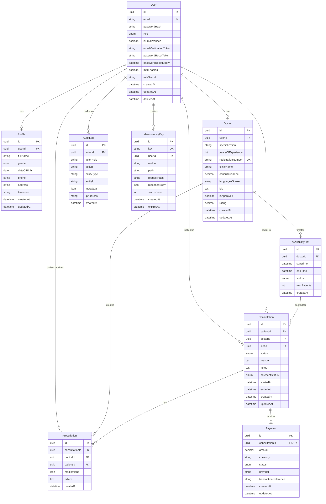

# Entity-Relationship Diagram

This document describes the database schema for the Amrutam Telemedicine Backend.

## ER Diagram



## Table Descriptions

### User
Core user table supporting multiple roles (PATIENT, DOCTOR, ADMIN, SUPPORT).

**Key Features**:
- Soft delete support via `deletedAt`
- Email verification workflow
- Password reset tokens
- MFA support

**Indexes**:
- `email` (unique)
- `role`
- `deletedAt`

### Profile
One-to-one relationship with User for demographic information.

**Key Features**:
- Timezone support for scheduling
- Optional fields for flexibility

### Doctor
Extended profile for users with DOCTOR role.

**Key Features**:
- Admin approval workflow (`isApproved`)
- Unique registration number
- Rating system
- Multi-language support

**Indexes**:
- `specialization`
- `isApproved`
- `rating`

### AvailabilitySlot
Doctor's available time slots for consultations.

**Key Features**:
- Status tracking (AVAILABLE, BOOKED, BLOCKED)
- Support for multiple patients per slot
- Unique constraint on `(doctorId, startTime, endTime, status)`

**Indexes**:
- `(doctorId, status)`
- `(startTime, endTime)`

### Consultation
Core entity representing a patient-doctor consultation.

**Key Features**:
- Lifecycle status tracking
- Payment status integration
- Timestamps for actual consultation times

**Indexes**:
- `patientId`
- `doctorId`
- `status`
- `createdAt`

### Prescription
Digital prescription linked to consultation.

**Key Features**:
- JSON medications array for flexibility
- Immutable (no updates, only creates)

**Indexes**:
- `consultationId`
- `patientId`

### Payment
Payment records for consultations.

**Key Features**:
- One-to-one with Consultation
- Stub provider integration
- Webhook support via transaction reference

**Indexes**:
- `status`
- `createdAt`

### AuditLog
Comprehensive audit trail for compliance.

**Key Features**:
- Flexible metadata JSON field
- IP address tracking
- Nullable actor for system actions

**Indexes**:
- `actorId`
- `action`
- `entityType`
- `createdAt`

### IdempotencyKey
Prevents duplicate requests.

**Key Features**:
- Unique key constraint
- Cached response storage
- TTL via `expiresAt`

**Indexes**:
- `key` (unique)
- `createdAt`
- `expiresAt`

## Relationships

### One-to-One
- User ↔ Profile
- User ↔ Doctor
- Consultation ↔ Payment

### One-to-Many
- User → Consultation (as patient)
- User → Consultation (as doctor)
- User → Prescription (as patient)
- User → AuditLog
- User → IdempotencyKey
- Doctor → AvailabilitySlot
- Doctor → Prescription
- AvailabilitySlot → Consultation
- Consultation → Prescription

## Data Integrity

### Constraints
- Foreign keys with cascading deletes where appropriate
- Unique constraints on email, registration number, idempotency key
- Composite unique constraint on availability slots
- Check constraints via Prisma enums

### Soft Deletes
- Users: `deletedAt` timestamp
- Preserves data integrity for historical records
- Excluded from active queries via `WHERE deletedAt IS NULL`

## Enums

### UserRole
- PATIENT
- DOCTOR
- ADMIN
- SUPPORT

### Gender
- MALE
- FEMALE
- OTHER
- PREFER_NOT_TO_SAY

### SlotStatus
- AVAILABLE
- BOOKED
- BLOCKED

### ConsultationStatus
- REQUESTED
- CONFIRMED
- IN_PROGRESS
- COMPLETED
- CANCELLED
- NO_SHOW

### PaymentStatus (Consultation)
- PENDING
- PAID
- FAILED

### PaymentTransactionStatus
- INITIATED
- SUCCESS
- FAILED

## Indexing Strategy

Indexes are created on:
1. Foreign keys for join performance
2. Frequently filtered columns (status, role, dates)
3. Unique constraints for data integrity
4. Composite indexes for common query patterns

## Scalability Considerations

### Partitioning Candidates
- **Consultations**: By date (monthly partitions)
- **AuditLog**: By date (monthly partitions)
- **IdempotencyKey**: By expiration (auto-cleanup)

### Archival Strategy
- Move completed consultations > 1 year to archive table
- Compress old audit logs
- Purge expired idempotency keys

## Migration Strategy

Prisma handles migrations automatically:
```bash
npx prisma migrate dev    # Development
npx prisma migrate deploy  # Production
```

All schema changes are version-controlled in `prisma/migrations/`.
